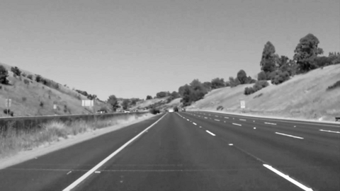
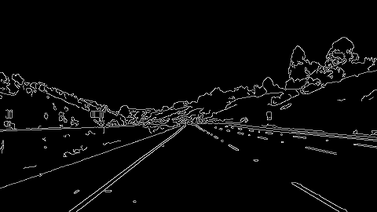
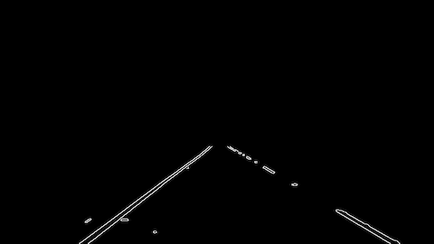
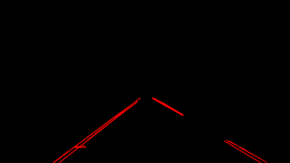
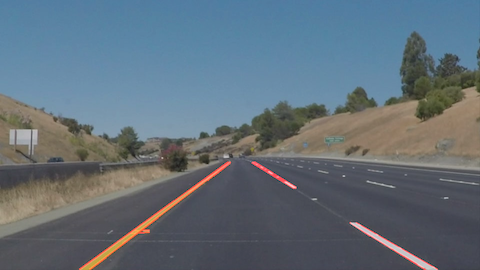

**Finding Lane Lines on the Road**
==================================

###  

**Finding Lane Lines on the Road**

The goals / steps of this project are the following:

\* Make a pipeline that finds lane lines on the road

 

**PIPELINE**
------------

 

### 1. Grayscale Conversion.

For this purpose I am using the provided **grayscale** function.

It uses OpenCV :

`cv2.cvtColor(img, cv2.COLOR_RGB2GRAY) `

 

### 2. Gaussian smoothing

Using Gaussian filtering with Kernel = 5 pixels to smooth the image

and remove unuseful details

 

### 3. Edge Detection: Canny filter

Canny filter detect edges calculating the derivatives of the color change
between point to point. When the derivative is increasing rapidly, then an edge
will be detected

I can use the Canny filter to detect image Edges, using a low_threshold = 30 and
high_threshold = 50 \* 3 = 150 ( three times the low as Reccomended )

If a pixel value is greater then the high_threshold it is marked as a strong
edge pixel, if a pixel value is lower than low_threshold is is simply removed

### 3. Image Crop: using a mask to crop only the interested area:

We crop a well defined portion of** 1-layer image ( 1 color ) ** and fill the
remaining parts of image with black color. This portion depends on which
position the camera is mounted. So it works in our example, but it can be
re-tuned for other cameras positions. Here the provided **region_of_interest**
function is used.

 

### 4. Lines Detection: Hough Space

In hough space the lines are converted into points.

The points in Hough Spaces indicated that in the original image a sequence of
pixel stays on the same line. Obiously can be lightly displaced but they will be
also caught by the OpenCV **cv2.HoughLinesP.**

Here the Parameters used:

`#Line detection parameters using Hough space`

`    rho = 1`

`    theta = np.pi/180 # in degree --> we choose 1 degree`

`    threshold = 15  #--> meaning at least 15 points in `

`                    #    image space need to be associated with each line
segment`

`    min_line_len = 30`

`    max_line_gap = 20`

 

 

### 5. Fusion of the original image with the detected lines marked in red:

cv2.addWeighted(initial_img, α, img, β, λ)

 

**TEST ON PROVIDED IMAGES​**
---------------------------

The input folder **test_images** is processed using the Pipeline above.

You can see the result in [test_images_output](test_images_output) folder:

 

[test_images_output/solidWhiteCurve.jpg](test_images_output/solidWhiteCurve.jpg)

[test_images_output/solidWhiteRight.jpg](test_images_output/solidWhiteRight.jpg)

[test_images_output/solidYellowCurve.jpg](test_images_output/solidYellowCurve.jpg)

[test_images_output/solidYellowCurve2.jpg](test_images_output/solidYellowCurve2.jpg)

[test_images_output/solidYellowLeft.jpg](test_images_output/solidYellowLeft.jpg)

[test_images_output/whiteCarLaneSwitch.jpg](test_images_output/whiteCarLaneSwitch.jpg)

 

**TEST ON **[solidWhiteRight.mp4]**  VIDEO**
--------------------------------------------

In order to test on Videos, a new function containing the Pipeline is defined:
**process_image(image).**

To read from a .mp4 video the  library moviepy.editor is used:

from **moviepy.editor** import **VideoFileClip**

 

Then to read the Video:  **clip1**` =
VideoFileClip("test_videos/solidWhiteRight.mp4")`

A new output Video clip is created with following command:

**white_clip** = clip1.fl_image(process_image)

The argument of **fl_image** is the function **process_image** that **I have
implemented **with my own code, and containing the PIPELINE described above

 

The first test is on the video :[test_videos/solidWhiteRight.mp4
](test_videos/solidWhiteRight.mp4)

And the **output result:
**[test_videos_output/solidWhiteRight.mp4](test_videos_output/solidWhiteRight.mp4)

 

**IMPROVE DRAW_LINE FUNCTION TEST ON PROVIDED VIDEOS​**
------------------------------------------------------

**Here I try to define a line to run the full length of the visible lane based
on the line segments  identified with the Hough Transform.**

 

**Here the steps followed:**

 

### 1. Calculate the slope of each Hough Transform segment:

`slope, yint = np.polyfit((x1, x2), (y1, y2), 1)`

I can now check if the  slope is between ( abs )  .35 and .85, to remove lines
that are not, probably, lane lines.

 

### 2. Based on this slope divide the segments into left lane segments and right lane segments:

`if slope > 0: `

`# right lines`

`else `

`# left lines`

### 3. Calculate and put into arrays, all the points on this segments:

Having a specific segment start point (x1,y1) and end point (x2,y2), I add all
the middle points:

~~~~~~~~~~~~~~~~~~~~~~~~~~~~~~~~~~~~~~~~~~~~~~~~~~~~~~~~~~~~~~~~~~~~~~~~~~~~~~~~
for x in range(x1, x2):
~~~~~~~~~~~~~~~~~~~~~~~~~~~~~~~~~~~~~~~~~~~~~~~~~~~~~~~~~~~~~~~~~~~~~~~~~~~~~~~~

~~~~~~~~~~~~~~~~~~~~~~~~~~~~~~~~~~~~~~~~~~~~~~~~~~~~~~~~~~~~~~~~~~~~~~~~~~~~~~~~
                      y = x *slope + yint
~~~~~~~~~~~~~~~~~~~~~~~~~~~~~~~~~~~~~~~~~~~~~~~~~~~~~~~~~~~~~~~~~~~~~~~~~~~~~~~~

~~~~~~~~~~~~~~~~~~~~~~~~~~~~~~~~~~~~~~~~~~~~~~~~~~~~~~~~~~~~~~~~~~~~~~~~~~~~~~~~
                      right_lane_x.append(x)
~~~~~~~~~~~~~~~~~~~~~~~~~~~~~~~~~~~~~~~~~~~~~~~~~~~~~~~~~~~~~~~~~~~~~~~~~~~~~~~~

~~~~~~~~~~~~~~~~~~~~~~~~~~~~~~~~~~~~~~~~~~~~~~~~~~~~~~~~~~~~~~~~~~~~~~~~~~~~~~~~
                      right_lane_y.append(y)

~~~~~~~~~~~~~~~~~~~~~~~~~~~~~~~~~~~~~~~~~~~~~~~~~~~~~~~~~~~~~~~~~~~~~~~~~~~~~~~~

### 3. Using Polyfit calculate the Linear Regression between al of this points ( obviously divided into left and right line )

~~~~~~~~~~~~~~~~~~~~~~~~~~~~~~~~~~~~~~~~~~~~~~~~~~~~~~~~~~~~~~~~~~~~~~~~~~~~~~~~
slope, intercept = np.polyfit(right_lane_y, right_lane_x, 1)
~~~~~~~~~~~~~~~~~~~~~~~~~~~~~~~~~~~~~~~~~~~~~~~~~~~~~~~~~~~~~~~~~~~~~~~~~~~~~~~~

### 3. Calculate the remainin part of each lane line until the **bottom** of the image  

Note that in previous **polyfit** I have **inverted the y/x linear** fit because
I wanted to calculate the bottom x -position starting the well-known y-position
( y is the bottom of the image in this case ):

~~~~~~~~~~~~~~~~~~~~~~~~~~~~~~~~~~~~~~~~~~~~~~~~~~~~~~~~~~~~~~~~~~~~~~~~~~~~~~~~
    y_bottom =img.shape[0]  # IMAGE HEIGHT --> Y
~~~~~~~~~~~~~~~~~~~~~~~~~~~~~~~~~~~~~~~~~~~~~~~~~~~~~~~~~~~~~~~~~~~~~~~~~~~~~~~~

~~~~~~~~~~~~~~~~~~~~~~~~~~~~~~~~~~~~~~~~~~~~~~~~~~~~~~~~~~~~~~~~~~~~~~~~~~~~~~~~
    x_bottom = y_bottom * slope + intercept
~~~~~~~~~~~~~~~~~~~~~~~~~~~~~~~~~~~~~~~~~~~~~~~~~~~~~~~~~~~~~~~~~~~~~~~~~~~~~~~~

### 4. Run again the Linear fit using Numpy Polyfit on all the points including the BOTTOM position

~~~~~~~~~~~~~~~~~~~~~~~~~~~~~~~~~~~~~~~~~~~~~~~~~~~~~~~~~~~~~~~~~~~~~~~~~~~~~~~~
# NOW I CALCULATE AGAIN THE SLOPE THROUGH ALL THE POINTS
~~~~~~~~~~~~~~~~~~~~~~~~~~~~~~~~~~~~~~~~~~~~~~~~~~~~~~~~~~~~~~~~~~~~~~~~~~~~~~~~

~~~~~~~~~~~~~~~~~~~~~~~~~~~~~~~~~~~~~~~~~~~~~~~~~~~~~~~~~~~~~~~~~~~~~~~~~~~~~~~~
    slope, intercept = np.polyfit(right_lane_x, right_lane_y, 1)
~~~~~~~~~~~~~~~~~~~~~~~~~~~~~~~~~~~~~~~~~~~~~~~~~~~~~~~~~~~~~~~~~~~~~~~~~~~~~~~~

### 5. Drawing a straight line from the bottom of the image until the top ( The top is the top of the MASK, used before to mask with black color the unused image area )

~~~~~~~~~~~~~~~~~~~~~~~~~~~~~~~~~~~~~~~~~~~~~~~~~~~~~~~~~~~~~~~~~~~~~~~~~~~~~~~~
    top_mask_x = vertices[2,0] # THIS IS THE TOP right X POSITION OF THE MASK
~~~~~~~~~~~~~~~~~~~~~~~~~~~~~~~~~~~~~~~~~~~~~~~~~~~~~~~~~~~~~~~~~~~~~~~~~~~~~~~~

~~~~~~~~~~~~~~~~~~~~~~~~~~~~~~~~~~~~~~~~~~~~~~~~~~~~~~~~~~~~~~~~~~~~~~~~~~~~~~~~
    top_mask_y = top_mask_x*slope + intercept
~~~~~~~~~~~~~~~~~~~~~~~~~~~~~~~~~~~~~~~~~~~~~~~~~~~~~~~~~~~~~~~~~~~~~~~~~~~~~~~~

~~~~~~~~~~~~~~~~~~~~~~~~~~~~~~~~~~~~~~~~~~~~~~~~~~~~~~~~~~~~~~~~~~~~~~~~~~~~~~~~
    
~~~~~~~~~~~~~~~~~~~~~~~~~~~~~~~~~~~~~~~~~~~~~~~~~~~~~~~~~~~~~~~~~~~~~~~~~~~~~~~~

~~~~~~~~~~~~~~~~~~~~~~~~~~~~~~~~~~~~~~~~~~~~~~~~~~~~~~~~~~~~~~~~~~~~~~~~~~~~~~~~
    # draw the line from bottom to the top of the mask
~~~~~~~~~~~~~~~~~~~~~~~~~~~~~~~~~~~~~~~~~~~~~~~~~~~~~~~~~~~~~~~~~~~~~~~~~~~~~~~~

~~~~~~~~~~~~~~~~~~~~~~~~~~~~~~~~~~~~~~~~~~~~~~~~~~~~~~~~~~~~~~~~~~~~~~~~~~~~~~~~
    cv2.line(img, (int(x_bottom), int(y_bottom)), (int(top_mask_x), int(top_mask_y)), color, thickness) 
~~~~~~~~~~~~~~~~~~~~~~~~~~~~~~~~~~~~~~~~~~~~~~~~~~~~~~~~~~~~~~~~~~~~~~~~~~~~~~~~

 

**TEST ON **solidYellowLeft.mp4**  VIDEO**
------------------------------------------

This video shows the **STABILITY ** of the drawed lined using the modified
**Draw_line** function

Input video: [test_videos/solidYellowLeft.mp4](test_videos/solidYellowLeft.mp4)

 

Output video result:
[test_videos_output/solidYellowLeft.mp4](test_videos_output/solidYellowLeft.mp4)

 

**OPTIONAL CHALLENGE**
----------------------

**​**In order to process this video I had to change a little bit the Vertices
calculation:

~~~~~~~~~~~~~~~~~~~~~~~~~~~~~~~~~~~~~~~~~~~~~~~~~~~~~~~~~~~~~~~~~~~~~~~~~~~~~~~~
# Need to change the Mask of the image:
~~~~~~~~~~~~~~~~~~~~~~~~~~~~~~~~~~~~~~~~~~~~~~~~~~~~~~~~~~~~~~~~~~~~~~~~~~~~~~~~

~~~~~~~~~~~~~~~~~~~~~~~~~~~~~~~~~~~~~~~~~~~~~~~~~~~~~~~~~~~~~~~~~~~~~~~~~~~~~~~~
def calc_vertices( img):
~~~~~~~~~~~~~~~~~~~~~~~~~~~~~~~~~~~~~~~~~~~~~~~~~~~~~~~~~~~~~~~~~~~~~~~~~~~~~~~~

~~~~~~~~~~~~~~~~~~~~~~~~~~~~~~~~~~~~~~~~~~~~~~~~~~~~~~~~~~~~~~~~~~~~~~~~~~~~~~~~
    imshape = img.shape
~~~~~~~~~~~~~~~~~~~~~~~~~~~~~~~~~~~~~~~~~~~~~~~~~~~~~~~~~~~~~~~~~~~~~~~~~~~~~~~~

~~~~~~~~~~~~~~~~~~~~~~~~~~~~~~~~~~~~~~~~~~~~~~~~~~~~~~~~~~~~~~~~~~~~~~~~~~~~~~~~

~~~~~~~~~~~~~~~~~~~~~~~~~~~~~~~~~~~~~~~~~~~~~~~~~~~~~~~~~~~~~~~~~~~~~~~~~~~~~~~~

~~~~~~~~~~~~~~~~~~~~~~~~~~~~~~~~~~~~~~~~~~~~~~~~~~~~~~~~~~~~~~~~~~~~~~~~~~~~~~~~
    vertices = np.array([[(.1*imshape[1],imshape[0]*.8),      # <-- bottom left
~~~~~~~~~~~~~~~~~~~~~~~~~~~~~~~~~~~~~~~~~~~~~~~~~~~~~~~~~~~~~~~~~~~~~~~~~~~~~~~~

~~~~~~~~~~~~~~~~~~~~~~~~~~~~~~~~~~~~~~~~~~~~~~~~~~~~~~~~~~~~~~~~~~~~~~~~~~~~~~~~
                      (.47*imshape[1] ,  .6*imshape[0]),      # <-- top left
~~~~~~~~~~~~~~~~~~~~~~~~~~~~~~~~~~~~~~~~~~~~~~~~~~~~~~~~~~~~~~~~~~~~~~~~~~~~~~~~

~~~~~~~~~~~~~~~~~~~~~~~~~~~~~~~~~~~~~~~~~~~~~~~~~~~~~~~~~~~~~~~~~~~~~~~~~~~~~~~~
                      (.55*imshape[1],  .6*imshape[0]),        # <-- top right
~~~~~~~~~~~~~~~~~~~~~~~~~~~~~~~~~~~~~~~~~~~~~~~~~~~~~~~~~~~~~~~~~~~~~~~~~~~~~~~~

~~~~~~~~~~~~~~~~~~~~~~~~~~~~~~~~~~~~~~~~~~~~~~~~~~~~~~~~~~~~~~~~~~~~~~~~~~~~~~~~
                    (.95*imshape[1],imshape[0]*.8)]], dtype=np.int32)  # <-- bottom right
~~~~~~~~~~~~~~~~~~~~~~~~~~~~~~~~~~~~~~~~~~~~~~~~~~~~~~~~~~~~~~~~~~~~~~~~~~~~~~~~

~~~~~~~~~~~~~~~~~~~~~~~~~~~~~~~~~~~~~~~~~~~~~~~~~~~~~~~~~~~~~~~~~~~~~~~~~~~~~~~~

~~~~~~~~~~~~~~~~~~~~~~~~~~~~~~~~~~~~~~~~~~~~~~~~~~~~~~~~~~~~~~~~~~~~~~~~~~~~~~~~

~~~~~~~~~~~~~~~~~~~~~~~~~~~~~~~~~~~~~~~~~~~~~~~~~~~~~~~~~~~~~~~~~~~~~~~~~~~~~~~~
    return  vertices
~~~~~~~~~~~~~~~~~~~~~~~~~~~~~~~~~~~~~~~~~~~~~~~~~~~~~~~~~~~~~~~~~~~~~~~~~~~~~~~~

**See the result here:**

<iframe width="854" height="480" src="test_videos/challenge.mp4" frameborder="0" allowfullscreen></iframe>
