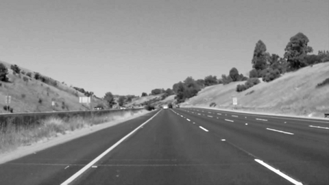
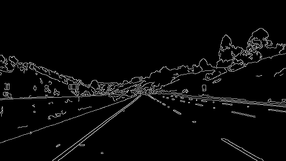
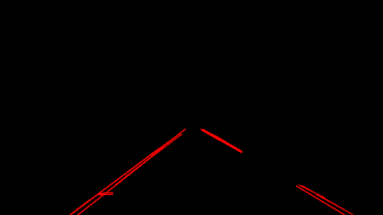
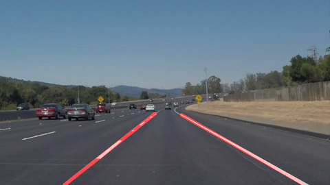

**Finding Lane Lines on the Road**
==================================

###  

**Finding Lane Lines on the Road**

The goals / steps of this project are the following:

\* Make a pipeline that finds lane lines on the road

 

### 1. My Pipeline consists of the following steps

Converting the images / video from Color into Grayscale:

Then I use the Gaussian filter with a Kernel = 5 to smooth the image

and remove too many details

 

Now I can use the Canny filter to detect image Edges, using a low_threshold = 30
and high_threshold = 30 \* 3 = 90:

 

And using the cv2.HoughLinesP , lines detection, detect all the lines using

the following parameters:

rho = 2

theta = np.pi/180 \# in degree --\> we choose 1 degree

threshold = 15  \#--\> meaning at least 15 points in

\#    image space need to be associated with each line segment

min_line_len = 30

max_line_gap = 20

 

### 2. Identifying the full extent of the lane and marking it clearly

To do this, I have modified the draw_lines function:

-   in the Draw_lines I am getting back the x1,y1,x2,y2 from cv2.HoughLinesP

    -   I am calculating the slope and intercept for each segment :

        slope, yint = np.polyfit((x1, x2), (y1, y2), 1)

    -   Now I can check if the abs of the slope is between .35 and .85, to
        remove lines that are not, probably, lane lines:

if .35 \< np.absolute(slope) \<= .85:

-   Now I need to divide the segments in Left Lane Segments and Right Lane
    Segments:

    if slope \> 0: \#\# right lines

    else             \# left lines

    -   Having a specific segment start point (x1,y1) and end point (x2,y2), I
        add all the middle points:

    **for x in range(x1, x2):**

**                      y = x \*slope + yint**

**                      right_lane_x.append(x)**

**                      right_lane_y.append(y)**

-   Now I have two arrays for each lane **right_lane_x**/**right_lane_y** +
    **left_lane_x/left_lane_y,** with ALL THE POINTS from all lines detected by
    cv2.HoughLinesP

    -   But I am still missing the line continuation from the bottom of the
        image.

        For this reason I need to calculate the slope and intercept of y respect
        to x , in order to reconstruct the x point at the bottom:

        **slope, intercept = np.polyfit(right_lane_y, right_lane_x, 1)**

         

        **    \# WITH THIS SLOPE NOW  GETTING THE X -POSITION FOR THE BOTTOM OF
        THE IMAGE**

        **    \# ( TO DRAW A LINE FROM THE BOTTOM )**

        **    y_bottom =img.shape[0]  \# IMAGE HEIGHT --\> Y**

        **    x_bottom = y_bottom \* slope + intercept**

    -   Now that I have all these points, I will run the numpy polyfit (

        Least squares polynomial fit.)

        slope, intercept = np.polyfit(right_lane_x, right_lane_y, 1)

    -   Now that I know the bottom start of the line and the slope and intercept
        , I can draw an ideal line from bottom to the top of the masked image:

        top_mask_x = vertices[2,0] \# THIS IS THE TOP right X POSITION OF THE
        MASK

        top_mask_y = top_mask_x\*slope + intercept

        

        \# draw the line from bottom to the top of the mask

        cv2.line(img, (int(x_bottom), int(y_bottom)), (int(top_mask_x),
        int(top_mask_y)), color, thickness)

The result is an image like this:

And if Draw_lines used for the video:

 

 

### 2. Identify potential shortcomings with your current pipeline

One potential shortcoming would be what would happen when ...

Another shortcoming could be ...

### 3. Suggest possible improvements to your pipeline

A possible improvement would be to ...

Another potential improvement could be to ...
